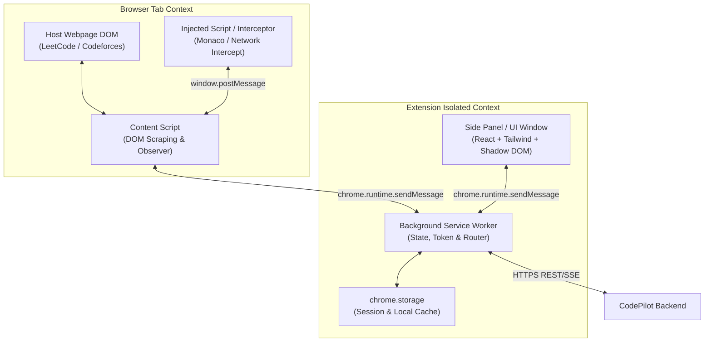
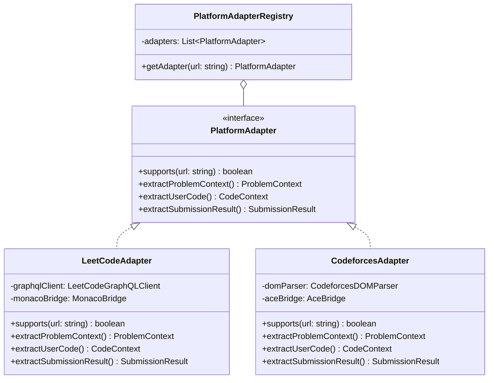
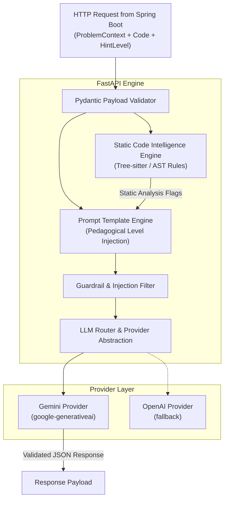
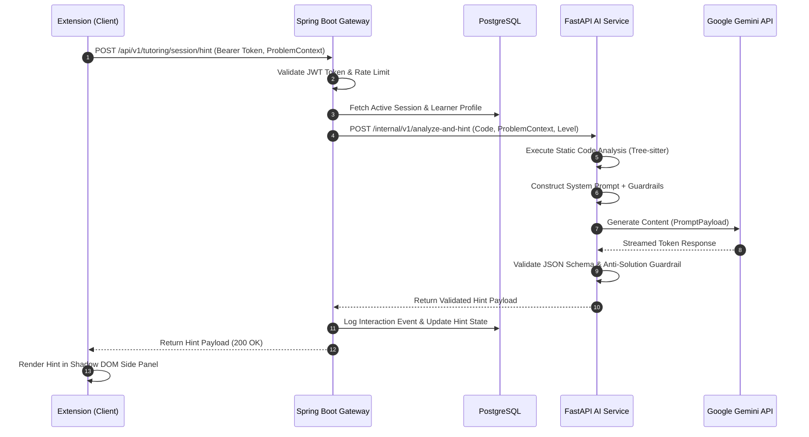
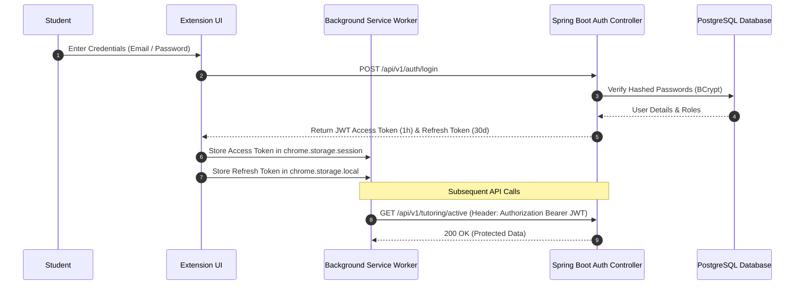
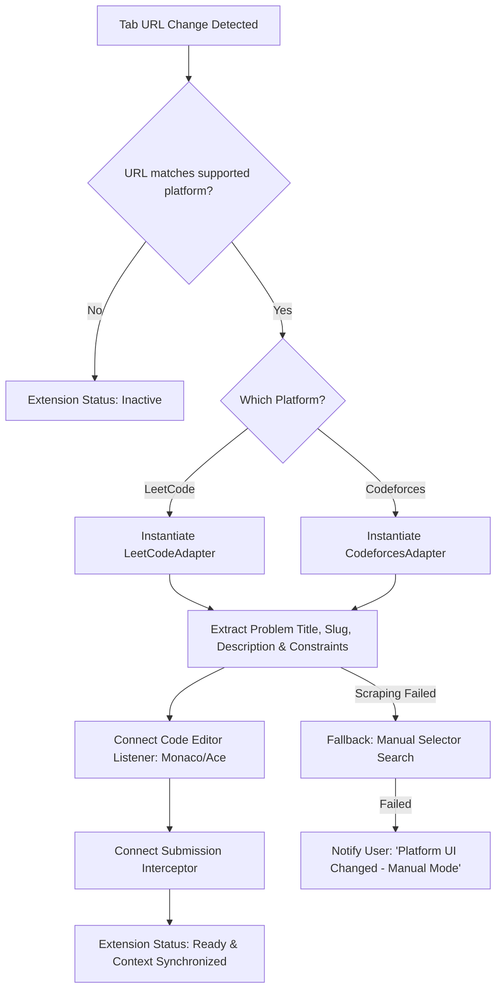
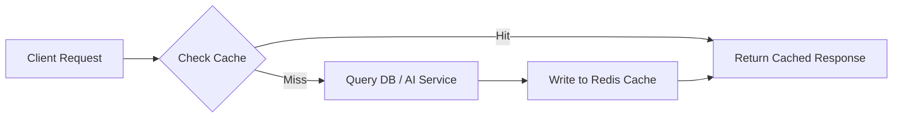
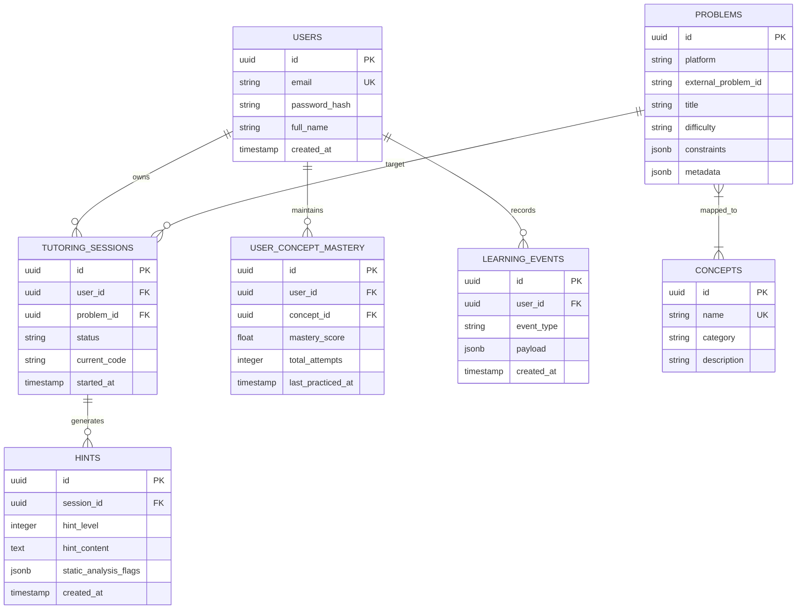

# CodePilot Architecture Specification

> **System Version:** 1.0.0-MVP  
> **Status:** Draft / Pending Review  
> **Author:** Principal Software Architect & Lead Engineer  
> **Date:** August 2026  

---

## 1. Executive Summary

**CodePilot** is an AI-powered coding mentor delivered primarily as a browser extension that operates alongside popular competitive programming and interview preparation platforms (e.g., LeetCode, Codeforces). Unlike generic AI code generators or solution-dumping tools, CodePilot enforces a pedagogical philosophy centered on Socratic tutoring: **"Teach the student how to think, not just what to type."**

The platform consists of a **Manifest V3 browser extension**, a **modular backend built with Spring Boot 3 (Java 21)**, a **specialized AI & Code Intelligence service powered by FastAPI (Python 3.12)**, and a **Next.js Web Dashboard** for skill tracking and analytics. By combining deterministic static code analysis (syntax trees, complexity estimation, code smell detection) with dynamic LLM reasoning, CodePilot provides progressive 5-tier hints, conceptual explanations, edge-case warnings, and adaptive learning profile tracking without revealing raw solutions prematurely.

---

## 2. Product Vision

CodePilot fills the gap between traditional algorithmic practice platforms (which present static test cases and forum solutions) and private human tutoring. 

```
+-------------------------------------------------------------------------------+
|                             TRADITIONAL APPROACH                              |
|   Stuck on Problem ---> Search Discussions ---> Copy/Paste Solution ---> Fake Progress|
+-------------------------------------------------------------------------------+
                                       VS
+-------------------------------------------------------------------------------+
|                              CODEPILOT APPROACH                               |
|   Stuck on Problem ---> Socratic Question ---> Guided Hint ---> Concept Mastered |
+-------------------------------------------------------------------------------+
```

### Core Value Pillars
1. **Contextual Awareness:** Seamlessly extracts problem specifications, constraints, user code, and submission execution errors from supported platforms.
2. **Progressive Pedagogical Guidance:** Delivers hints in 5 calibrated levels—ranging from high-level Socratic inquiries to structural pseudocode—preventing solution reliance.
3. **Deterministic & Generative Intelligence:** Merges static code analysis (for structural flaws, infinite loops, and complexity) with LLM reasoning (for pedagogical explanation).
4. **Longitudinal Mastery Tracking:** Dynamically computes concept mastery percentages (e.g., Dynamic Programming: 31%, Graphs: 48%, Hash Maps: 74%) to guide future practice.

---

## 3. Core User Journey

```
Student opens LeetCode / Codeforces
       │
       ▼
CodePilot Extension auto-detects platform & problem context
       │
       ▼
Student writes code attempt & gets stuck (or hits TLE / WA)
       │
       ▼
Student clicks "Ask CodePilot" in Extension Panel
       │
       ▼
Extension normalizes context & sends request to Spring Boot Backend
       │
       ▼
Backend invokes Code Intelligence Engine (AST / static complexity checks)
       │
       ▼
Backend queries Learner Profile (concept history & current hint level state)
       │
       ▼
Backend forwards enriched payload to FastAPI AI Service
       │
       ▼
AI Service synthesizes Socratic / Progressive Hint via Gemini (with prompt guardrails)
       │
       ▼
Extension displays hint level (e.g., Level 0: Socratic Question)
       │
       ▼
Student updates code; Learning Engine records interaction & updates skill profile
```

---

## 4. MVP Scope

The Initial Minimum Viable Product (MVP) delivers end-to-end functionality across four primary subsystems:

* **Browser Extension (Manifest V3):**
  * Built with React, TypeScript, and Tailwind CSS.
  * Side Panel UI integration with fallback Floating Panel.
  * Platform Adapters for **LeetCode** and **Codeforces**.
  * Automatic problem extraction, editor code sync, and submission result parsing.
* **Core Backend Service:**
  * Modular Monolith using **Spring Boot 3** & **Java 21**.
  * User authentication & session management via **Spring Security** & **JWT**.
  * Relational data storage with **PostgreSQL** & high-speed caching via **Redis**.
  * Domain modules for Users, Problems, Tutoring Sessions, and Learning Engine.
* **AI & Code Intelligence Service:**
  * Microservice using **FastAPI** & **Python 3.12**.
  * Deterministic static analysis (AST parsing via Tree-sitter/Python `ast`, complexity heuristic calculations, anti-pattern detection).
  * LLM Orchestration supporting **Google Gemini API** with pluggable architecture for OpenAI / local models.
  * Progressive 5-tier hint generator and prompt guardrails.
* **Web Dashboard:**
  * Single Page Application using **Next.js 14** (App Router), TypeScript, and Tailwind CSS.
  * Visual analytics (radar charts for concept mastery, activity heatmaps, weak area diagnostics, and personalized problem recommendations).

---

## 5. Out-of-Scope Features

To maintain execution speed and architectural clarity, the following features are explicitly deferred post-MVP:

* Standalone CodePilot online code execution engine / sandbox (code execution occurs on the target platform).
* Real-time AI Mock Interviewer (voice / interactive audio agent).
* RAG-based proprietary enterprise question database.
* Social/Multiplayer coding challenges and peer leaderboards.
* Native mobile application (iOS / Android).

---

## 6. Functional Requirements

| ID | Module | Description | Priority |
|---|---|---|---|
| **FR-01** | Extension | Auto-detect supported platforms (LeetCode, Codeforces) upon URL matching. | P0 |
| **FR-02** | Extension | Extract normalized problem payload (title, description, constraints, examples, tags, user code, error outputs). | P0 |
| **FR-03** | Extension | Render non-intrusive side-panel interface offering hint requests, level selectors, and concept summaries. | P0 |
| **FR-04** | Auth | Register and authenticate users via Email/Password or OAuth2, issuing secure JWT tokens. | P0 |
| **FR-05** | Tutoring | Implement a 5-tier progressive hint state machine (Level 0: Socratic Probe to Level 4: Full Explanation). | P0 |
| **FR-06** | Code Intel | Run deterministic static analysis to identify nested loops, recursion depth, missing base cases, and time/space complexity. | P0 |
| **FR-07** | AI Engine | Generate pedagogical hints via LLM using structured prompt guardrails to block full code dumps unless explicitly at Level 4. | P0 |
| **FR-08** | Learning | Track problem attempts, hints requested, time spent, submission outcomes, and update concept mastery profiles. | P0 |
| **FR-09** | Recommendation | Calculate weakest concepts and generate prioritized practice problem recommendations. | P1 |
| **FR-10** | Dashboard | Display user skill radar, historical progress, recent tutoring sessions, and concept breakdown charts. | P1 |

---

## 7. Non-Functional Requirements

* **Performance:**
  * Extension DOM context extraction overhead < 100ms.
  * Static code analysis processing time < 150ms.
  * End-to-end hint generation response latency < 2.5s (using streaming SSE responses).
* **Security & Privacy:**
  * Zero execution of arbitrary untrusted user code on CodePilot servers.
  * Extension permissions scoped strictly to `activeTab`, `storage`, and `sidePanel`.
  * Secure token storage (`chrome.storage.session` for access tokens).
  * Sanitization of all prompt inputs to prevent Prompt Injection attacks.
* **Reliability & Resilience:**
  * Graceful degradation: If target platform DOM mutates or AI service fails, fallback to static structural analysis and user-facing notifications without breaking the host page.
  * Circuit breakers and retry mechanisms on AI provider API calls.
* **Maintainability:**
  * Clean separation between platform-specific extraction logic and core domain models.
  * Pluggable AI provider interface to allow hot-swapping LLM models without altering business logic.

---

## 8. Architecture Decision

### Modular Monolith + AI Microservice vs. Pure Microservices

```
                       ARCHITECTURE EVALUATION
  
  Pure Microservices                    Modular Monolith + AI Service (SELECTED)
+-------------------+                 +-----------------------------------------+
| Extension Service |                 |            Spring Boot Backend          |
| Auth Service      |                 |  +----------+ +----------+ +-----------+  |
| Problem Service   |                 |  |   Auth   | | Problem  | |  Learning |  |
| Learning Service  |  VS             |  |  Module  | |  Module  | |   Engine  |  |
| Recommendation    |                 |  +----------+ +----------+ +-----------+  |
| AI Gateway        |                 +--------------------+--------------------+
+-------------------+                                      | REST / gRPC
High Ops Complexity,                                       v
Network Overhead                                  +-------------------+
                                                  | FastAPI AI Service|
                                                  +-------------------+
```

#### Decision Matrix

| Dimension | Microservices | Modular Monolith (Core) + AI Service (Selected) | Single Monolith (Java Only) |
|---|---|---|---|
| **Development Speed** | Low (High DevOps overhead) | **High** (Rapid iterations, clear bounds) | Medium |
| **Language Best-fit** | High (Multi-language) | **High** (Java for Core, Python for AI) | Low (Java ML tools inferior) |
| **Operational Cost** | High (Multiple deployments) | **Low** (2 primary runtime containers) | Lowest |
| **Domain Isolation** | High (Hard network boundary)| **High** (Java package isolation) | Medium |

**Architectural Choice:** We adopt a **Modular Monolith for the Backend (Spring Boot 3 / Java 21)** paired with a **Dedicated AI Microservice (FastAPI / Python 3.12)**. This provides the optimal balance: Java handles robust enterprise features (security, ORM, multi-threading, transactional integrity), while Python leverages the rich ecosystem for AST parsing, static analysis, and LLM orchestration.

---

## 9. High-Level Architecture

### System Architecture Diagram

```mermaid
graph TD
    subgraph Client Layer
        EXT["Browser Extension (Manifest V3)<br/>React + TypeScript + Shadow DOM"]
        DASH["Web Dashboard<br/>Next.js 14 + Tailwind CSS"]
    end

    subgraph API & Routing Layer
        GW["Spring Security / API Gateway<br/>JWT Auth & Rate Limiting"]
    end

    subgraph Backend Core (Spring Boot 3 / Java 21)
        MOD_AUTH["Auth Module"]
        MOD_PROB["Problem Catalog Module"]
        MOD_TUTOR["Tutoring Session Module"]
        MOD_LEARN["Learning Engine Module"]
        MOD_REC["Recommendation Module"]
    end

    subgraph Persistence Layer
        PG[("PostgreSQL 16<br/>Relational Data")]
        REDIS[("Redis 7<br/>Session & Prompt Cache")]
    end

    subgraph AI & Code Intelligence (FastAPI / Python 3.12)
        STAT["Static Analysis Engine<br/>Tree-sitter / AST / Complexity"]
        PROMPT["Prompt & Guardrail Pipeline"]
        AI_ROUTER["LLM Provider Router"]
    end

    subgraph External Services
        GEMINI["Google Gemini API"]
        OPENAI["OpenAI API (Fallback)"]
        LEET["LeetCode / Codeforces"]
    end

    EXT -->|DOM Scraping / Intercept| LEET
    EXT -->|REST / SSE / HTTPS| GW
    DASH -->|REST / HTTPS| GW

    GW --> MOD_AUTH
    GW --> MOD_PROB
    GW --> MOD_TUTOR
    GW --> MOD_LEARN
    GW --> MOD_REC

    MOD_AUTH --> PG
    MOD_PROB --> PG
    MOD_LEARN --> PG
    MOD_TUTOR --> REDIS

    MOD_TUTOR -->|HTTP / JSON| STAT
    STAT --> PROMPT
    PROMPT --> AI_ROUTER
    AI_ROUTER -->|HTTPS| GEMINI
    AI_ROUTER -.->|HTTPS Fallback| OPENAI
```

---

## 10. Component Responsibilities

### 1. Browser Extension (`/extension`)
* **Platform Detection:** Identifies current URL patterns (`leetcode.com/problems/*`, `codeforces.com/problemset/problem/*`).
* **DOM & Network Interceptor:** Extracts problem text, constraints, test cases, and reads code from active Monaco/Ace editor instances.
* **Side Panel UI:** Renders reactive tutoring view, hint request buttons, level controls, and chat history.
* **State & Sync:** Persists extension auth tokens in `chrome.storage.session` and syncs offline attempt buffers.

### 2. Spring Boot Core Backend (`/backend`)
* **Security & Auth:** Handles user registration, JWT generation/validation, password hashing (BCrypt), and rate limiting.
* **Problem & Context Normalization:** Maps platform-specific payloads into standard internal `ProblemContext` schemas.
* **Tutoring Session Management:** Manages state machines for active hints, tracking progressive levels per problem attempt.
* **Learning Engine:** Computes concept mastery metrics using modified Bayesian Knowledge Tracing algorithms.
* **Recommendation Engine:** Evaluates skill gaps and queries recommended problem sets.

### 3. FastAPI AI Service (`/ai-service`)
* **Deterministic Code Intelligence:** Computes AST properties, nested loop depths, recursive branching factor, and anti-pattern flags.
* **Prompt Engineering & Isolation:** Assembles structured system and user prompts with explicit pedagogical guardrails.
* **LLM Integration:** Manages API calls to Gemini (and OpenAI fallback), handles streaming tokens, and enforces JSON output validation.
* **Misconception Detection:** Identifies classic DSA blunders (e.g., off-by-one errors, missing base cases, invalid pointer shifts).

### 4. Next.js Web Dashboard (`/web`)
* **Visual Analytics:** Renders skill breakdown charts, historical progression timelines, and weak area alerts.
* **Session Explorer:** Allows users to review past tutoring dialogues and saved hints.
* **Account & Settings:** Profile management, connected platform management, and goal setting.

---

## 11. Browser Extension Architecture

The extension uses Manifest V3 architecture with strict separation between isolated content script contexts and the main web page DOM.



### Key Technical Details
* **Shadow DOM Wrapper:** The side panel / overlay UI components are encapsulated inside a Custom Element with Shadow Root to prevent CSS contamination from target websites.
* **Code Extraction Mechanics:**
  * *LeetCode:* Uses `window.postMessage` bridge to interact with Monaco Editor instance (`monaco.editor.getModels()[0].getValue()`) with fallback to DOM textarea scraping.
  * *Codeforces:* Reads directly from Ace Editor or standard submission `<textarea>` elements.
* **Network Interceptor:** Intercepts outgoing GraphQL calls on LeetCode to obtain clean problem statements and submission execution feedback (`status_msg`, `runtime`, `memory`, `total_correct`).

---

## 12. Platform Adapter Architecture

To prevent target platform DOM changes from breaking the AI system, platform-specific extraction is encapsulated behind a unified adapter interface.



### Normalized Internal Schema (`ProblemContext`)

```json
{
  "platform": "LEETCODE",
  "externalProblemId": "15",
  "title": "3Sum",
  "slug": "3sum",
  "description": "Given an integer array nums, return all the triplets...",
  "difficulty": "MEDIUM",
  "tags": ["Array", "Two Pointers", "Sorting"],
  "constraints": ["3 <= nums.length <= 3000", "-10^5 <= nums[i] <= 10^5"],
  "examples": [
    {
      "input": "nums = [-1,0,1,2,-1,-4]",
      "output": "[[-1,-1,2],[-1,0,1]]"
    }
  ],
  "studentCode": "class Solution {\n    public List<List<Integer>> threeSum(int[] nums) {\n        ...\n    }\n}",
  "language": "JAVA",
  "submissionResult": {
    "status": "TIME_LIMIT_EXCEEDED",
    "lastTestedCase": "[0,0,0,0,0,0,0...]",
    "rawError": "Time Limit Exceeded on Test Case 312/313"
  }
}
```

---

## 13. Backend Architecture (Spring Boot 3)

The backend follows a **Clean Modular Monolith** package structure divided strictly by business domains.

```
com.codepilot
├── config/                 # Security, Redis, CORS, OpenAPI Config
├── common/                 # Global Exceptions, Base DTOs, Utilities
├── domain/
│   ├── auth/               # Controller, Service, User/Role Entities, JWT Filters
│   ├── problem/            # Controller, Service, Problem & Tag Entities
│   ├── tutoring/           # Controller, Service, Session & Hint Entities, AI Client
│   ├── learning/           # Controller, Service, Mastery & Event Entities
│   └── recommendation/     # Controller, Service, Recommendation Strategy
└── infrastructure/
    ├── client/             # Feign/WebClient for FastAPI AI Service
    ├── persistence/        # Spring Data JPA Repositories
    └── cache/              # Redis Cache Service & Keys
```

### Core Technologies & Principles
* **Java 21 Virtual Threads (Loom):** Leveraged for highly concurrent non-blocking I/O during HTTP communication with the FastAPI service and database operations.
* **Spring Security & JWT:** Stateless authentication filter chain validating `Bearer` tokens on every request.
* **Spring Data JPA & Hibernate:** Type-safe database queries mapped to PostgreSQL tables.
* **Redis Caching Layer:** Caches problem statement metadata (24h TTL) and rate limit counter tokens (1m TTL).

---

## 14. AI Service Architecture (FastAPI)

The AI service handles static code analysis, prompt orchestration, and LLM communication.



### Pluggable Provider Architecture

```python
class LLMProvider(ABC):
    @abstractmethod
    async def generate_tutoring_response(
        self, 
        prompt: str, 
        system_instruction: str, 
        temperature: float = 0.2
    ) -> TutoringResponse:
        pass

class GeminiProvider(LLMProvider):
    async def generate_tutoring_response(...):
        # Implementation using google-generativeai SDK
        pass

class OpenAIProvider(LLMProvider):
    async def generate_tutoring_response(...):
        # Implementation using openai SDK
        pass
```

---

## 15. Code Intelligence Architecture

To avoid relying solely on non-deterministic LLM output, CodePilot executes a **Deterministic Static Analysis Pipeline** before contacting the LLM.

```
                   CODE INTELLIGENCE PIPELINE
  
  Student Code (Java/Python/C++)
               │
               ▼
      [Tree-sitter Parser]
               │
               ├──────────────────────────┐
               ▼                          ▼
     [AST Metric Extractor]     [Pattern Matcher Rules]
               │                          │
               ├─ Loop Depth Count        ├─ Missing Base Cases
               ├─ Recursion Detector      ├─ Unchecked Index Access
               └─ Time Complexity Estimate └─ Anti-pattern Flags
               │                          │
               └────────────┬─────────────┘
                            ▼
           Static Code Analysis Report (JSON)
                            │
                            ▼
          Injected into System Prompt for LLM
```

### Static Analysis Detectors
1. **Nested Loop Inspector:** Detects $O(N^2)$ or $O(N^3)$ loop structures and alerts the LLM if the problem constraints require $O(N \log N)$.
2. **Recursion & Base-Case Checker:** Scans recursive function signatures for terminating conditional branches.
3. **Space Complexity Estimator:** Analyzes allocation of auxiliary data structures (e.g., extra arrays, 2D DP matrices).
4. **Common Mistake Rule Engines:** Checks for integer overflow risks, floating-point comparisons, and modified collections during iteration.

---

## 16. Learning Engine Architecture

The Learning Engine calculates and maintains the student's **Concept Mastery Profile** using a modified Bayesian Knowledge Tracing (BKT) and decay-weighted Elo rating algorithm.

### Concept Taxonomy Tree
* **Data Structures:** Arrays, Strings, Linked Lists, Stacks, Queues, Hash Tables, Trees, Binary Search Trees, Heaps, Graphs, Tries.
* **Algorithms:** Two Pointers, Sliding Window, Fast & Slow Pointers, Binary Search, Breadth-First Search (BFS), Depth-First Search (DFS), Backtracking, Greedy, Dynamic Programming, Bit Manipulation.

### Mastery Calculation Formula

The concept mastery score $M \in [0.0, 1.0]$ for a concept $c$ after interaction $t$ is defined by:

$$M_{c, t} = \sigma \left( \text{logit}(M_{c, t-1}) + \Delta_{outcome} + \Delta_{hint\_penalty} + \Delta_{difficulty} \right) \cdot e^{-\lambda \Delta t}$$

Where:
* $\sigma(x) = \frac{1}{1 + e^{-x}}$ is the sigmoid function.
* $\Delta_{outcome} = +0.35$ for Accepted (AC), $-0.25$ for Wrong Answer (WA/TLE).
* $\Delta_{hint\_penalty} = -0.05 \times \text{HintLevelRequested}$ (Higher hint requests diminish mastery gain).
* $\Delta_{difficulty} = \text{DifficultyWeight(Easy: 0.8, Medium: 1.0, Hard: 1.3)}$.
* $e^{-\lambda \Delta t}$ represents exponential decay over time $\Delta t$ without practice ($\lambda = 0.01\text{ days}^{-1}$).

---

## 17. Dashboard Architecture

The Web Dashboard is implemented with **Next.js 14 App Router** for high-performance visual analytics.

```
web/
├── app/
│   ├── (auth)/
│   │   ├── login/page.tsx
│   │   └── register/page.tsx
│   ├── (dashboard)/
│   │   ├── page.tsx                  # Main Analytics Overview
│   │   ├── concepts/page.tsx         # Detailed Skill Radar & Tree
│   │   ├── history/page.tsx          # Past Tutoring Log Explorer
│   │   └── recommendations/page.tsx  # Recommended Problem Queue
│   ├── layout.tsx
│   └── globals.css
├── components/
│   ├── ui/                           # Reusable UI primitives (Button, Card, Modal)
│   ├── charts/                       # Skill Radar, Heatmap, Mastery Curves
│   └── tutoring/                     # Read-only hint playback dialogs
└── lib/
    ├── api.ts                        # Axios API Client
    └── store.ts                      # Zustand state store
```

---

## 18. Communication Between Components



---

## 19. Data Flow

```
[Target Page: LeetCode/Codeforces]
       │
       │ (1) Extract DOM & Editor State
       ▼
[Extension Content Script]
       │
       │ (2) Post Message via chrome.runtime
       ▼
[Extension Service Worker]
       │
       │ (3) REST HTTPS (ProblemContext Payload + Bearer JWT)
       ▼
[Spring Boot Backend Gateway]
       │
       ├─► (4a) Query / Update [PostgreSQL: Sessions & Users]
       │
       │ (4b) Internal HTTP POST
       ▼
[FastAPI AI & Code Intel Service]
       │
       ├─► (5a) Static Analysis AST Parser
       │
       ├─► (5b) Call Gemini API (HTTPS)
       │
       │ (6) Synthesized Hint JSON
       ▼
[Spring Boot Backend]
       │
       │ (7) Async Event -> Update Concept Mastery Profile
       │
       │ (8) Send HTTP Response
       ▼
[Extension Side Panel UI]
```

---

## 20. Authentication Flow



---

## 21. AI Tutoring Flow & Progressive Hint Strategy

CodePilot relies on a **5-Tier Progressive Hint State Machine**. The system will refuse to jump levels unless the student explicitly requests a higher tier or completes an attempt iteration.

```
  +-------------------------------------------------------------------------+
  |                        HINT LEVEL STATE MACHINE                         |
  |                                                                         |
  |  Level 0: Socratic Inquiry                                              |
  |    "What happens when the array contains duplicate elements?"           |
  |                               │                                         |
  |                               ▼                                         |
  |  Level 1: Conceptual Nudge                                              |
  |    "Consider using the Two-Pointer technique after sorting."            |
  |                               │                                         |
  |                               ▼                                         |
  |  Level 2: Directional Strategy                                          |
  |    "Fix pointer i, then use pointers j and k to find pairs summing to -nums[i]."
  |                               │                                         |
  |                               ▼                                         |
  |  Level 3: Algorithmic Blueprint (Pseudocode)                            |
  |    "Sort nums -> Loop i from 0 to N-2 -> Set left=i+1, right=N-1 -> ..."   |
  |                               │                                         |
  |                               ▼                                         |
  |  Level 4: Full Explanation & Code (Requires Explicit Confirmation)       |
  |    "Here is the complete Java implementation with complexity analysis." |
  +-------------------------------------------------------------------------+
```

### Prompt Guardrail Injection Rules
Every prompt sent to the LLM includes strict system constraints:
1. **Anti-Solution Rule:** *"Unless the target hint level is strictly LEVEL_4, you MUST NOT output executable code snippets longer than 2 lines. Focus entirely on conceptual explanation and structural questioning."*
2. **Anti-Hallucination Rule:** *"Rely exclusively on the provided problem constraints and static analysis flags. Do not invent non-existent test cases or library methods."*
3. **Format Enforcement:** *"Output your response in strict JSON adhering to the specified TutoringResponse schema."*

---

## 22. Platform Integration Flow



---

## 23. Error Handling Strategy

| Scenario | Detection Mechanism | Mitigation / Fallback Strategy | User Impact |
|---|---|---|---|
| **Platform DOM Mutation** | Selector query returns `null` or empty string. | Fallback to network response interceptor or prompt user to select text manually. | Warning banner: "DOM changed. Using cached context." |
| **Extension Offline** | `navigator.onLine == false` or fetch fails. | Buffer interaction events in `chrome.storage.local`. | Toast notification: "Working offline. Syncing when reconnected." |
| **Expired JWT Token** | HTTP `401 Unauthorized` response. | Service Worker automatically invokes `/auth/refresh` token endpoint. | Seamless background refresh; no user disruption. |
| **AI Service Rate Limit (429)**| FastAPI returns HTTP 429 or Gemini Quota Error. | Switch to OpenAI fallback provider or Redis static hint cache. | Slight latency increase (1-2s). |
| **Malformed LLM Output** | Pydantic JSON Validation Error. | Automatic retry prompt to LLM (max 2 retries) with strict schema instruction. | Resolved transparently within backend. |

---

## 24. Security Architecture

### 1. Browser Extension Permissions (Least Privilege)
```json
{
  "manifest_version": 3,
  "name": "CodePilot AI Mentor",
  "permissions": [
    "activeTab",
    "storage",
    "sidePanel"
  ],
  "host_permissions": [
    "https://leetcode.com/*",
    "https://codeforces.com/*",
    "https://api.codepilot.dev/*"
  ]
}
```

### 2. Prompt Injection Safeguards
* User code and custom input are placed within strict delimited blocks (`<user_code>` tags) and sanitized to strip system prompt escape sequences (e.g., `IGNORE ALL PREVIOUS INSTRUCTIONS`).
* The system prompt is enforced as an immutable system instruction in the Gemini API payload.

### 3. Server Security & Code Execution Policy
* **Zero Arbitrary Execution:** CodePilot **never** compiles or executes student code on backend infrastructure for the MVP. All execution occurs directly on target platforms (LeetCode / Codeforces).
* **Network & API Security:** CORS headers restricted to official extension IDs and dashboard domains. Rate limiting set to 30 hint requests per hour per user using Redis token buckets.

---

## 25. Scalability Strategy

1. **Stateless API Gateway & Backend:** Spring Boot instances are stateless, enabling horizontal auto-scaling behind an Application Load Balancer (ALB).
2. **Asynchronous Event Processing:** Learning profile updates and analytics logging are executed asynchronously via Spring `@Async` and Redis Pub/Sub, preventing database writes from delaying hint responses.
3. **Database Indexing & Connection Pooling:** PostgreSQL uses HikariCP connection pooling with optimized B-tree indexes on `(user_id, concept_id)` and `(platform, external_problem_id)`.

---

## 26. Caching Strategy



### Redis Cache Keys & Policies

| Key Pattern | Data Stored | TTL | Invalidation Trigger |
|---|---|---|---|
| `problem:metadata:{platform}:{id}` | Normalized Problem Statement | 24 Hours | Platform update or manual refresh |
| `user:mastery:{userId}` | Concept Mastery Profile Map | 1 Hour | User completes a new problem |
| `rate:hint:{userId}` | Token Bucket Counter | 1 Minute | Time sliding window |
| `hint:static:{problemId}:{level}`| Static Generic Hints | 7 Days | Problem updated |

---

## 27. Observability Strategy

* **Structured JSON Logging:** All log outputs structured with Logback (Java) and Structlog (Python) containing trace IDs (`traceId`, `userId`, `platform`, `problemId`).
* **Metrics (Prometheus & Micrometer):**
  * `codepilot_hint_requests_total{level, platform}`
  * `codepilot_ai_latency_seconds{provider}`
  * `codepilot_static_analysis_duration_ms`
  * `codepilot_llm_token_usage_total{model}`
* **Distributed Tracing:** OpenTelemetry instrumentation across Spring Boot and FastAPI endpoints.

---

## 28. Deployment Architecture

```mermaid
graph TD
    subgraph Cloud Infrastructure (AWS / GCP)
        DNS["Route 53 / Cloudflare DNS"]
        ALB["Application Load Balancer / Ingress"]
        
        subgraph Kubernetes Cluster / ECS
            SB_PODS["Spring Boot Core Backend Pods<br/>(Auto-scaling 2-10 instances)"]
            AI_PODS["FastAPI AI Service Pods<br/>(Auto-scaling 2-8 instances)"]
        end
        
        subgraph Managed Data Services
            RDS[("Amazon RDS PostgreSQL 16<br/>(Multi-AZ)")]
            ELASTI[("Amazon ElastiCache Redis 7<br/>(Cluster Mode)")]
        end

        CDN["Cloudfront CDN"]
        AMPLIFY["Next.js Web Dashboard<br/>(AWS Amplify / Vercel)"]
    end

    DNS --> ALB
    DNS --> CDN
    CDN --> AMPLIFY
    ALB --> SB_PODS
    SB_PODS --> AI_PODS
    SB_PODS --> RDS
    SB_PODS --> ELASTI
```

---

## 29. Monorepo Directory Structure

```
codepilot/
├── docs/
│   └── architecture/
│       ├── ARCHITECTURE.md
│       └── ARCHITECTURE_DECISIONS.md
├── extension/
│   ├── src/
│   │   ├── background/         # Service Worker & Token Router
│   │   ├── content/            # DOM Parsing & Platform Adapters
│   │   ├── sidepanel/          # React Side Panel App
│   │   ├── components/         # UI Elements in Shadow DOM
│   │   ├── adapters/           # LeetCode & Codeforces Adapters
│   │   └── manifest.json       # Manifest V3 Configuration
│   ├── package.json
│   └── vite.config.ts
├── backend/
│   ├── src/main/java/com/codepilot/
│   │   ├── auth/
│   │   ├── problem/
│   │   ├── tutoring/
│   │   ├── learning/
│   │   └── CodePilotApplication.java
│   ├── src/main/resources/     # application.yml, db/migration (Flyway)
│   ├── pom.xml
│   └── Dockerfile
├── ai-service/
│   ├── app/
│   │   ├── main.py             # FastAPI App Entrypoint
│   │   ├── api/                # Endpoints (Analyze, Hint)
│   │   ├── core/               # Configuration & Logging
│   │   ├── intel/              # Tree-sitter AST & Static Analysis
│   │   ├── prompts/            # Level-based Prompt Templates
│   │   └── providers/          # Gemini & OpenAI Provider Classes
│   ├── pyproject.toml
│   └── Dockerfile
├── web/
│   ├── app/                    # Next.js 14 App Router Pages
│   ├── components/             # Tailwind UI & Chart Components
│   ├── package.json
│   └── next.config.mjs
└── infrastructure/
    ├── docker-compose.yml      # Local Dev Environment (DB, Redis, Services)
    └── k8s/                    # Kubernetes Manifests
```

---

## 30. Database Design



---

## 31. Conceptual API Specification

### Authentication Endpoints
* `POST /api/v1/auth/register` - Create new student account.
* `POST /api/v1/auth/login` - Authenticate and return JWT access/refresh tokens.
* `POST /api/v1/auth/refresh` - Refresh access token using valid refresh token.

### Extension & Tutoring Endpoints
* `POST /api/v1/tutoring/session` - Initialize or resume a tutoring session for a given problem.
* `POST /api/v1/tutoring/hint` - Request next progressive hint.
  * **Request:** `{ sessionId: "...", userCode: "...", currentLevel: 1, submissionResult: {...} }`
  * **Response:** `{ hintId: "...", hintLevel: 1, content: "...", staticAnalysisSummary: {...} }`
* `GET /api/v1/tutoring/session/{sessionId}/history` - Retrieve dialogue and hint history for active problem.

### Learning & Dashboard Endpoints
* `GET /api/v1/learning/mastery` - Fetch student's current concept mastery profile map.
* `GET /api/v1/learning/recommendations` - Get personalized problem recommendations based on weakest concepts.
* `GET /api/v1/dashboard/stats` - Summary analytics for web dashboard.

---

## 32. Testing Strategy

1. **Unit Testing:**
   * Backend: JUnit 5 & Mockito for service and domain logic testing.
   * AI Service: Pytest for AST analysis routines and Pydantic validation.
   * Extension: Vitest for platform adapter text extraction parsing.
2. **Integration Testing:**
   * Backend: Testcontainers powering PostgreSQL and Redis tests.
   * AI Service: VCR.py for recording and playing back deterministic LLM provider HTTP interactions.
3. **End-to-End (E2E) Extension Testing:**
   * Playwright browser automation running against mock LeetCode and Codeforces static pages to verify DOM extraction stability.

---

## 33. Future Extension Points

* **Isolated Docker Execution Sandbox:** Add a dedicated runner service using micro-VMs (Firecracker or gVisor) to safely evaluate user code against custom edge cases.
* **AI Interviewer Mode:** Introduce real-time audio and timer-constrained interactive coding interviews.
* **RAG Knowledge Base:** Integrate company-specific interview problem trends and theoretical computer science textbooks into the context pipeline.

---


---

## 34. Phase 8 — Production Hardening, Deployment & Observability

### Service Boundaries & Container Networking

CodePilot uses Docker bridge networking (`codepilot-network`) with canonical service discovery names:

```
+--------------------------------------------------------+
|               Docker Bridge Network                    |
|                                                        |
|  +-------------------+        +--------------------+   |
|  | codepilot-backend | <----> |codepilot-ai-service|   |
|  | (Spring Boot:8080)|  HTTP  | (FastAPI:8000)     |   |
|  +--------+----------+        +--------------------+   |
|           |                                            |
|     +-----+--------------+                             |
|     |                    |                             |
|     v                    v                             |
| +---------------+ +---------------+                    |
| |codepilot-     | |codepilot-     |                    |
| |postgres (5432)| |redis (6379)   |                    |
| +---------------+ +---------------+                    |
|                                                        |
|  +-------------------+                                 |
|  | codepilot-web     | ---> Browser (Client-side API)  |
|  | (Next.js:3000)    |                                 |
|  +-------------------+                                 |
+--------------------------------------------------------+
```

### Health & Readiness Probes

| Service | Endpoint | Probe Type | Behavior |
|---|---|---|---|
| **Backend** | `GET /api/v1/health` | Liveness | Returns `{"status":"UP", "service":"codepilot-backend", "timestamp":"..."}` |
| **Backend** | `GET /actuator/health` | Deep Health | Spring Boot Actuator component status (secured in prod) |
| **AI Service** | `GET /api/v1/health` | Liveness | Returns `{"status":"UP", "service":"codepilot-ai-service", "version":"..."}` |
| **AI Service** | `GET /api/v1/readiness`| Readiness | Verifies Tree-sitter AST grammar load without calling external LLM |
| **Web Dashboard**| `GET /api/health` | Liveness | Lightweight Next.js route returning `{ "status": "UP" }` |

### Resilience & Failure Boundaries

1. **AI Service Timeout & Fallback:**
   - Spring Boot `RestClient` enforces a 30-second read timeout and 5-second connect timeout via `RestClientCustomizer`.
   - AI service unreachable / 5xx responses map to `503 Service Unavailable` with user-friendly error messages.
   - `@Transactional` is isolated from the external AI HTTP call to prevent database connection pool exhaustion.

2. **Redis Graceful Degradation:**
   - Redis connectivity failure does not crash the Spring Boot application on startup.
   - Cache operations fail open without blocking core request execution.

3. **Client Network Resilience:**
   - Browser extension `fetchWithTimeout` enforces a 15-second `AbortController` timeout on all network requests.
   - Network errors and 401s surface clear UI guidance rather than hanging spinners.

### Observability & Request Tracing

- **Correlation IDs:** The servlet filter `RequestIdFilter` assigns an `X-Request-ID` header (or generates an 8-character UUID) to every inbound request and injects it into the SLF4J MDC (`requestId`).
- **Structured Error Responses:** All error responses use the standard `ApiResponse` envelope without leaking stack traces or internal exception details.
